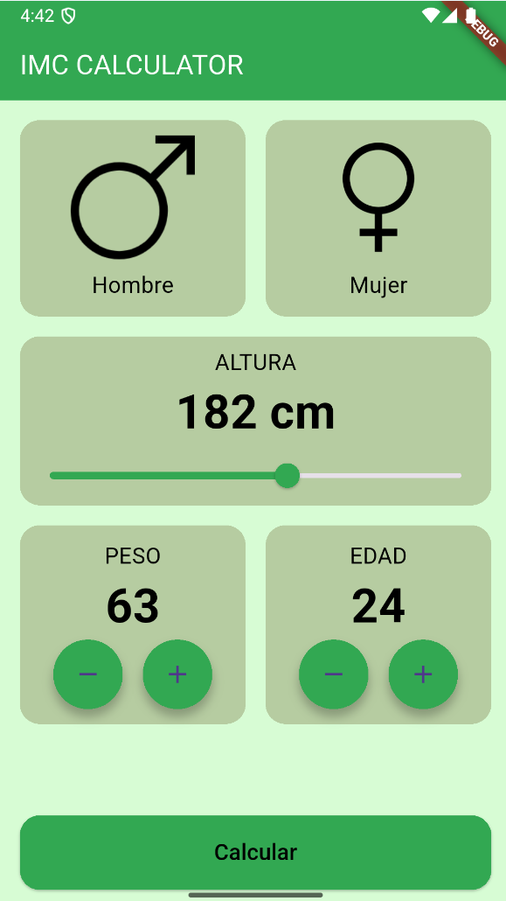
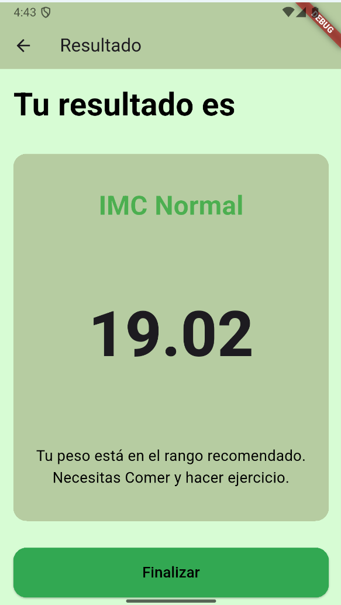

# Calculadora de IMC - Flutter App

Esta es una aplicación móvil desarrollada con **Flutter** que permite calcular el **Índice de Masa Corporal (IMC)** de una persona. La app proporciona una interfaz intuitiva y fácil de usar para que los usuarios ingresen sus datos personales y obtengan un resultado inmediato.

## 🧠 Funcionalidades

- Selección de **género** (masculino o femenino).
- Ajuste de **altura** mediante un slider interactivo.
- Modificación de **peso** y **edad** con botones "+" y "−".
- Cálculo del **IMC** con un solo clic en el botón **"Calcular"**.
- Visualización del resultado del IMC junto con una interpretación textual (ej. Bajo peso, Normal, Sobrepeso, etc.).

## 🎯 Objetivo

Calcular el IMC a partir de la siguiente fórmula:

```

IMC = peso (kg) / (altura (m) \* altura (m))

```

`Home Screen`



`Result Screen`



---

## 🚀 Cómo usar

1. Clona este repositorio:

   ```bash
   git clone https://github.com/CUBOVR/imcCalculator.git
   cd imcCalculator
   ```

2. Instala las dependencias:

   ```bash
   flutter pub get
   ```

3. Ejecuta la aplicación:

   ```bash
   flutter run
   ```

## 🛠️ Tecnologías utilizadas

- [](https://flutter.dev/)
- [](https://dart.dev/)

## 📁 Estructura del proyecto (simplificada)

---

lib/
├── main.dart
├── screens/
│ ├── imc_homeScreen.dart
│ └── imc_resultScreen.dart
├── components/
│ ├── genderSelector.dart
│ ├── heightSelector.dart
│ ├── numberSelector.dart
│ └── bottom_button.dart
└── core/
├── app_colors.dart
├── button_styles.dart
└── text_styles.dart

---

## 📌 Notas

- El diseño se inspira en prácticas modernas de UI con uso de tarjetas y componentes reutilizables.

## 🧑‍💻 Autor

Desarrollado por \[CUBOVR]

---

¡Gracias por usar esta aplicación! Si tienes sugerencias o encuentras algún error, no dudes en abrir un issue o enviar un pull request.
